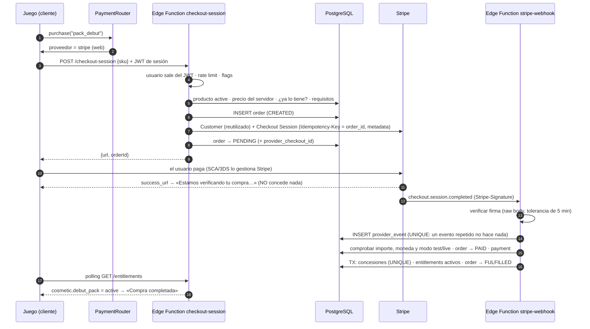

# Comercio real: arquitectura de «Del barrio al negocio»

> Estado: **MOCK + STRIPE TEST**. No se activa ningún pago real hasta que digas «ACTIVAR PRODUCCIÓN».
> Los textos legales están marcados como **requiere revisión legal**.

El núcleo técnico se resume en una frase: **todo proveedor de pago termina en el mismo sitio, un ENTITLEMENT ACTIVO.**
Un entitlement es el derecho a usar algo (un pack, un deporte, una carrera). El juego nunca pregunta «¿pagó?», sino
«¿tiene el entitlement X?».

Índice:
1. Arquitectura propuesta
2. Esquema PostgreSQL
3. Diagrama de compra
4. Catálogo completo
5. Lista de SKUs (ver [CATALOG.md](CATALOG.md))
6. PaymentRouter
7. Estrategia Stripe ([STRIPE.md](STRIPE.md))
8. Estrategia Apple ([APPLE_BILLING.md](APPLE_BILLING.md))
9. Estrategia Google ([GOOGLE_BILLING.md](GOOGLE_BILLING.md))
10. Entitlements ([ENTITLEMENTS.md](ENTITLEMENTS.md))
11. Flujo de reembolsos y disputas
12. Amenazas de seguridad ([SECURITY_COMMERCE.md](SECURITY_COMMERCE.md))
13. Qué partes necesitan credenciales
14. Plan por fases

Otros documentos: [ACCOUNTS.md](ACCOUNTS.md) (cuenta, perfil, edad, permiso parental y carreras en la nube), [EXPANSIONS.md](EXPANSIONS.md), [PRESTIGE_CAREERS.md](PRESTIGE_CAREERS.md),
[TESTING_COMMERCE.md](TESTING_COMMERCE.md), [CHECKLIST.md](CHECKLIST.md) y
[FUENTES_PLATAFORMAS.md](FUENTES_PLATAFORMAS.md) (normas de Apple, Google y Stripe consultadas).

---

## 0. Principio comercial

**Gratis para jugar. Una compra da más juego o más identidad; nunca más poder.**

Nunca se venden victorias, resultados, ascensos, contratos, reputación, nivel, votos, cargos, empresas ni dinero del
juego. El código lo impone así:

- Un producto solo concede entitlements.
- Un entitlement solo abre contenido: cosméticos, modos de juego, ranuras de carrera o quitar anuncios.
- Ningún entitlement toca `s.p` (nivel, reputación, marca, dinero) ni el resultado de un partido. Hay tests de
  gameplay que lo comprueban.
- No hay moneda premium. Los precios se muestran en euros reales («0,99 €») y con un estilo distinto del dinero del
  juego.

## 1. Arquitectura propuesta

Seis conceptos que no se mezclan:

| Concepto | Qué es | Dónde vive | ¿Fuente de verdad de las compras? |
|---|---|---|---|
| GAME STATE | La partida (`s`) | localStorage o `game_saves` (opcional) | **No** |
| USER ACCOUNT | Identidad (Supabase Auth: Apple, Google, magic link) | `auth.users` + `profiles` | — |
| COMMERCE ACCOUNT | Cliente de Stripe y datos de facturación | `commerce_accounts` | — |
| CATALOG | Productos, precios e ids en cada plataforma | `commerce/catalog/catalog.js` + `products` y `product_prices` | Sí, para el precio |
| PAYMENTS | Órdenes, pagos, eventos de proveedor, reembolsos, disputas | `orders`, `payments`, `provider_events`, `refunds`, `disputes` | Sí, para el dinero |
| ENTITLEMENTS | Qué tiene cada usuario | `entitlement_grants` + `entitlements` | **Sí** |

Si un usuario borra la partida y empieza otra, sus entitlements siguen en la cuenta. El juego solo guarda una
**caché** de entitlements, en una clave de localStorage separada y que no forma parte de la partida.

```
commerce/                         núcleo compartido: módulos ES puros, sin dependencias
  catalog/catalog.js              catálogo versionado (productos, tipos, estados, contenidos, dependencias)
  core/money.js                   dinero real en unidades mínimas (céntimos)
  core/entitlements.js            registro de entitlements; activos a partir de las concesiones; bundles
  core/orders.js                  máquina de estados de las órdenes
  core/visibility.js              qué se muestra y qué se puede comprar (sin bombardear)
  core/router.js                  PaymentRouter: elige el proveedor
  core/config.js                  configuración remota y feature flags
  core/stripeSignature.js         firma y verificación de webhooks (WebCrypto)
  core/stripeApi.js               cliente REST mínimo de Stripe (fetch inyectado; solo en el servidor)
  core/service.js                 CommerceService: checkout, webhooks, entrega, reembolsos, restaurar,
                                  códigos promo, admin, borrado de cuenta
  core/memoryRepo.js              repositorio en memoria (tests y backend simulado del juego)
  core/pgRepo.js                  repositorio PostgreSQL (servidor)
  core/prestige.js                motor de Prestige Careers (estados LOCKED…FORMER)
  core/sports.js                  SPORTS[] y SPORT_MODULES[] (deportes como expansiones)
  core/ads.js                     AdProvider + MockAdProvider (placements recompensados)
  core/analytics.js               eventos del embudo (sin datos de tarjeta)
  client/providers.js             PaymentProvider: Mock, Stripe (web), Apple, Google
  client/commerceClient.js        cuenta, caché offline, sincronizar, restaurar, comprar
  client/mockBackend.js           backend simulado en el navegador (mismo servicio, Stripe falso)
backend/
  supabase/migrations/…_commerce.sql   tablas, restricciones, RLS, funciones
  supabase/functions/…                 checkout-session, stripe-webhook, entitlements, restore,
                                       promo-redeem, remote-config, admin, account-delete,
                                       apple-notifications, google-rtdn
  supabase/functions/_shared/commerce/ copia generada del núcleo (node commerce/sync.cjs)
  admin/index.html                     panel interno
  .env.example
```

**Por qué un único `CommerceService`:** la misma lógica corre en tres sitios:

- en las Edge Functions, con `PgRepo` y la API real de Stripe;
- en los tests, con `MemoryRepo` y también con un Postgres real;
- en el juego publicado, con `MemoryRepo` y un Stripe falso.

Así, lo que se prueba en el navegador es exactamente lo que correrá en el servidor.

**Por qué Postgres directo dentro de las Edge Functions** (`SUPABASE_DB_URL`, driver `pg`) y no PostgREST: las
transacciones. La entrega de una compra es «bloquear la orden → insertar las concesiones → marcar FULFILLED», y debe
ser atómica. La idempotencia la garantizan restricciones UNIQUE en la base de datos, no el código.

## 2. Esquema PostgreSQL

Migración completa: `backend/supabase/migrations/20261008000000_commerce.sql`. Tablas:

| Tabla | Para qué | Claves e índices únicos |
|---|---|---|
| `profiles` | Datos personales mínimos: nombre visible, país, `is_minor`, `is_tester` | PK `user_id` → `auth.users` |
| `devices` | Dispositivos (plataforma, versión) para restaurar y dar soporte | — |
| `commerce_accounts` | `stripe_customer_id` por usuario (uno solo) | UNIQUE `stripe_customer_id` |
| `admin_users` | Quién es admin | PK `user_id` |
| `catalog_versions` | Versiones del catálogo publicadas | — |
| `products` | Copia del catálogo en la BD: sku, tipo, estado, entitlements, requisitos | PK `id` (SKU) |
| `product_prices` | Precio por moneda en **unidades mínimas** | UNIQUE (`product_id`, `currency`) |
| `product_provider_ids` | sku → id del producto y del precio en Stripe, Apple y Google, por entorno | UNIQUE (`provider`, `environment`, `provider_product_id`) |
| `orders` | Una compra, con su estado | UNIQUE `provider_checkout_id`, UNIQUE `provider_payment_id` |
| `order_items` | Líneas de la orden (preparado para carrito o bundles) | — |
| `payments` | Cobros confirmados: bruto, impuestos, comisiones, neto | UNIQUE (`provider`, `provider_payment_id`) |
| `provider_events` | Todos los webhooks recibidos (idempotencia y auditoría) | UNIQUE (`provider`, `event_id`) |
| `entitlement_grants` | Cada concesión: fuente, compra, orden, estado, fecha de revocación | UNIQUE (`order_id`, `entitlement_id`), UNIQUE (`source`, `source_purchase_id`, `entitlement_id`) |
| `entitlements` | Estado actual por usuario y entitlement (activo si alguna concesión está activa) | PK (`user_id`, `entitlement_id`) |
| `refunds` | Reembolsos (también los que llegan «huérfanos» antes que la compra) | UNIQUE (`provider`, `provider_refund_id`) |
| `disputes` | Contracargos | UNIQUE (`provider`, `provider_dispute_id`) |
| `purchase_events` | Auditoría de cada transición y concesión | — |
| `iap_receipts` | Transacciones de Apple y Google verificadas en el servidor | UNIQUE (`provider`, `transaction_id`) |
| `subscriptions` | Preparada para el futuro; hoy sin uso | — |
| `ad_rewards` | Recompensas de anuncios con recompensa (tope por día) | — |
| `promo_codes` / `promo_redemptions` | Códigos para probadores, prensa y campañas | UNIQUE (`promo_id`, `user_id`) |
| `experiments` / `experiment_assignments` | Experimentos A/B | UNIQUE (`experiment_id`, `user_id`) |
| `remote_config` | Configuración remota por entorno | PK (`environment`, `key`) |
| `analytics_events` | Telemetría sin datos personales sensibles | — |
| `rate_limits` | Ventanas de límite (checkout, promo, restore, sync) | PK (`key`, `window_start`) |
| `admin_actions` | Auditoría de cada acción de admin (quién, a quién, qué, por qué) | — |
| `game_saves` | Opcional: copia de la partida en la nube | PK (`user_id`, `slot`) |

Dinero real: siempre `amount_minor bigint` + `currency char(3)`. Nunca `0.99` como float.

**RLS:** un usuario solo **lee** sus filas de `orders`, `order_items`, `payments`, `entitlement_grants`,
`entitlements`, `refunds`, `iap_receipts` y `ad_rewards`. Los productos activos los puede leer cualquiera. **No hay
ninguna política de INSERT ni UPDATE** en las tablas de comercio para `authenticated` ni para `anon`: solo el
backend, que se conecta como propietario, puede escribir. Los tests lo comprueban contra un Postgres real.

**Borrado de cuenta:** se borran `profiles`, `devices`, `game_saves` y `analytics_events`. Las filas contables
(`orders`, `payments`, `refunds`) se conservan **anonimizadas**: `user_id` pasa a NULL y se guarda un
`user_ref_hash` para poder responder a auditorías legales.

## 3. Diagrama de compra (web, Stripe Checkout)



Apple y Google siguen el mismo camino a partir del paso «verificado en el servidor»: `grantFromProvider()` →
orden FULFILLED → entitlement activo.

## 4. Catálogo completo

En `commerce/catalog/catalog.js` (versión 1). Detalle de cada producto y de su contenido en [CATALOG.md](CATALOG.md).

| Tipo | SKUs | Precio | Estado |
|---|---|---|---|
| COSMETIC_PACK | `pack_debut` | 0,99 € | active |
| COSMETIC_PACK | `pack_street`, `pack_pro`, `pack_luxury`, `pack_magnate` | 1,99 / 2,99 / 3,99 / 4,99 € | active |
| COSMETIC_PACK | `club_pack_{club}` (puerto, costa, atletico) | 0,99 / 1,99 € | active (solo visible con ese club) |
| COSMETIC_PACK | `champion_pack_{copa, europa, mundial, liga}` | 0,99 € | active (solo visible si ganaste esa competición) |
| SUPPORTER_PACK | `founder_pack` | 4,99 € | active |
| REMOVE_ADS | `remove_ads` | 3,99 € | active |
| SAVE_SLOTS | `extra_save_slots_3` | 1,99 € | active |
| SPORT_EXPANSION | `sport_climbing`, `sport_tennis`, `sport_basketball`, `sport_skate`, `sport_surf` | 2,99 € | active (jugables) |
| BUNDLE | `sports_bundle` | 8,99 € | active |
| SYSTEM_EXPANSION | `expansion_club_owner` | 3,99 € | active (jugable) |
| SYSTEM_EXPANSION | `expansion_real_estate`, `expansion_sports_agency`, `expansion_events`, `expansion_media` | 2,99 € | active (jugables) |
| BUNDLE | `empire_bundle` | 6,99 € | active |
| PRESTIGE_CAREER | `prestige_world_football_president`, `prestige_world_climbing_president` (requiere `sport.climbing`), `prestige_world_basket_president` (requiere `sport.basketball`), `prestige_world_tennis_president` (requiere `sport.tennis`), `prestige_league_president`, `prestige_national_federation`, `prestige_national_coach`, `prestige_sporting_director`, `prestige_agent`, `prestige_referee`, `prestige_media_personality` | 0,99 € | active (jugables) |
| PRESTIGE_CAREER | `prestige_world_sports_committee` (requiere 2 deportes) | 1,99 € | active (jugable) |
| BUNDLE | `prestige_bundle` (8 carreras con nombre; las futuras no se incluyen) | 3,99 € | active |
| PROMO | `promo_press` (insignia de prensa) | solo con código | active |
| FUTURE_SUBSCRIPTION | `season_pass` | — | draft |

«active» significa «a la venta» **en modo prueba**: hasta que digas «ACTIVAR PRODUCCIÓN» no hay pagos reales
(`liveModeAllowed=false`) y en producción, sin los ids de Stripe mapeados, no se vende nada.

Estados del producto:

- `draft` y `retired`: invisibles.
- `coming_soon`: se ve como «Próximamente» y **no se puede comprar**.
- `testing`: solo se puede comprar fuera de producción o con un usuario `is_tester`.
- `active`: se puede comprar.

Los nombres oficiales (FIFA, FIBA, IFSC, COI) **no se usan**. Las denominaciones son ficticias y se pueden cambiar en
el catálogo (`names`).

## 5. Lista de SKUs

Está en [CATALOG.md](CATALOG.md), con el entitlement que concede cada uno y su id en Apple y Google:
`com.delbarrio.<sku>` en Apple y `<sku>` en Google.

## 6. PaymentRouter

```
purchase(product, ctx):
  si ctx.platform = mock (prototipo) y no es producción → MockPaymentProvider
  si ctx.platform = web o pwa                   → StripePaymentProvider          (stripeEnabled)
  si ctx.platform = ios:
     si config.ios.externalPurchase.enabled, ctx.storefront está en la lista,
        el entitlement de Apple está aprobado y el dispositivo es elegible
        (ExternalPurchaseCustomLink.isEligible)  → StripePaymentProvider (con aviso del sistema y tokens)
     si no                                       → ApplePaymentProvider (StoreKit)   (appleBillingEnabled)
  si ctx.platform = android:
     si config.android.alternativeBilling.enabled, el país está en la lista
        y estamos inscritos                      → StripePaymentProvider (+ informe a Google)
     si no                                       → GooglePaymentProvider (Play Billing)  (googleBillingEnabled)
  nunca: «Stripe siempre». Si no hay ningún proveedor válido, la compra se bloquea con un motivo claro.
```

Implementación: `commerce/core/router.js`. La configuración llega por `remote_config`, así que se puede cambiar sin
recompilar. Los tests cubren cada rama.

## 7. Estrategia Stripe

Resumen; el detalle está en [STRIPE.md](STRIPE.md).

- Checkout Sessions con `mode=payment` (nada de suscripciones todavía).
- Un único Customer por usuario, en `commerce_accounts`.
- Correspondencia de ids: id lógico → `product_provider_ids` (Stripe product y price, por entorno).
- El precio se obtiene en el servidor: nunca se acepta un `price` del cliente.
- `Idempotency-Key` igual al `order_id`.
- Metadata: `user_id`, `product_id`, `order_id`, también en `payment_intent_data.metadata`.
- Stripe Tax con `automatic_tax[enabled]` y `customer_update[address]=auto`, activable desde la configuración.
- El código fiscal lo decide el asesor (ver FUENTES_PLATAFORMAS).
- Webhook con verificación propia del esquema `v1` (HMAC-SHA256 con WebCrypto, tolerancia de 300 s).
- Eventos atendidos:
  - `checkout.session.completed`, `checkout.session.async_payment_succeeded`, `checkout.session.async_payment_failed`
    y `checkout.session.expired`;
  - `charge.refunded` y `refund.updated`;
  - `charge.dispute.created` y `charge.dispute.closed`;
  - `payment_intent.payment_failed`.
- Versión de la API fijada en `STRIPE_API_VERSION` (hoy `2026-09-30.endive`).
- Alternativa a estudiar: **Stripe Managed Payments**, con Stripe como vendedor, que se encarga del IVA y las disputas.

## 8. Estrategia Apple

Detalle en [APPLE_BILLING.md](APPLE_BILLING.md).

- **StoreKit por defecto** para todo el contenido digital en iOS (norma 3.1.1).
- Validación en el servidor con la App Store Server API y las notificaciones V2: el JWS se verifica con la librería
  oficial.
- `appAccountToken` igual al id de nuestro usuario.
- Restaurar con `AppStore.sync()` y `Transaction.currentEntitlements`, y después reenviarlo al servidor.
- **UE con Stripe:** solo después de firmar los términos de la UE (anexo 14, desde el 2026-10-01), tener el permiso
  `custom-purchase-link`, mostrar el aviso del sistema, enviar los tokens a la External Purchase Server API y mantener
  la combinación de opciones durante 12 meses.
- Mientras no esté todo aprobado: **StoreKit**. El flag `ios.externalPurchase.enabled` está a `false`.
- Menores de 13: nunca ofertas externas. Entre 13 y 17: control parental.

## 9. Estrategia Google

Detalle en [GOOGLE_BILLING.md](GOOGLE_BILLING.md).

- **Play Billing (librería 8 o posterior) por defecto.**
- Validación en el servidor con `purchases.productsv2`, **reconocimiento en menos de 3 días**, notificaciones en tiempo
  real por Pub/Sub y la API de compras anuladas.
- `obfuscatedAccountId` igual al hash de nuestro id de usuario.
- **EEE:** facturación alternativa u ofertas externas solo si estamos inscritos. Hay que informar de cada transacción
  en 24 h. Stripe **no** elimina la comisión de Google (20 % o 10 %).
- Mientras tanto: **Play Billing**.

## 10. Entitlements

Detalle en [ENTITLEMENTS.md](ENTITLEMENTS.md).

- Un **grant** (concesión) es un hecho del pasado: «el pedido X concedió Y desde la fuente Z en tal fecha».
- Un **entitlement** está activo si al menos uno de sus grants está activo.
- Fuentes: `stripe`, `apple`, `google`, `promo`, `admin`, `legacy`.
- Un bundle concede varios entitlements. Si ya tienes alguno, se registra otro grant, pero el entitlement no se
  duplica.
- Si un reembolso revoca un grant pero hay otro activo (por ejemplo, de un bundle), el entitlement sigue activo.
- Nada se borra. La revocación guarda `revoked_at`, `revoke_reason` y la referencia del reembolso o la disputa.

## 11. Flujo de reembolsos y disputas

| Evento | Orden | Grants | Notas |
|---|---|---|---|
| Reembolso total (`charge.refunded`, importe reembolsado = total) | → REFUNDED | revocados (`revoked_at`, motivo, `provider_refund_id`) | queda una fila en `refunds` |
| Reembolso parcial | → PARTIALLY_REFUNDED | siguen activos (política `refunds.partialRevokes = false`) | configurable |
| Reembolso que llega **antes** que la compra (desorden) | se guarda en `refunds` con `order_id` NULL, por `provider_payment_id` | — | cuando llega el `completed`, la orden pasa a REFUNDED y **no se concede nada** |
| Disputa abierta (`charge.dispute.created`) | → DISPUTED | `suspended` (política `disputes.suspend = true`) | la cuenta no se borra |
| Disputa ganada (`charge.dispute.closed`, won) | → FULFILLED | se reactivan | |
| Disputa perdida (lost) | → REVOKED | revocados | |
| Reembolso de Apple (`REFUND`) o anulación de Google (voided) | → REFUNDED | revocados | mismo camino, `revokeBySource()` |

## 12. Amenazas de seguridad

Detalle y tests en [SECURITY_COMMERCE.md](SECURITY_COMMERCE.md). Resumen:

| Ataque | Defensa |
|---|---|
| Cambiar el precio desde DevTools | El servidor ignora cualquier precio del cliente: lo toma de `product_prices` y `product_provider_ids` |
| Cambiar el id del producto | Solo existen los SKUs del catálogo con un estado que se pueda comprar |
| Cambiar el user id | El usuario sale **siempre** del JWT de la sesión; el `userId` del cuerpo se ignora |
| Crear un entitlement a mano | RLS: sin políticas de INSERT ni UPDATE; solo el backend escribe |
| Abrir la success URL sin pagar | La success URL no concede nada; solo hace polling |
| Webhook falso o reenviado | Firma HMAC, tolerancia de 300 s y `provider_events` UNIQUE |
| Reutilizar un checkout | `provider_checkout_id` UNIQUE y la orden ya FULFILLED no se reabre |
| Mezclar test y live | Se comprueba `livemode` del evento contra el entorno; las claves y secretos van por entorno |
| Secretos en el cliente | El build del juego no contiene `sk_`, `rk_` ni `whsec_` (hay un test) |
| Abuso de endpoints | Rate limit en checkout, promo, restore y sync |
| Dark patterns | Sin cuentas atrás, sin preselección, botón «No, gracias» igual de visible (hay tests de UI) |

## 13. Qué partes necesitan credenciales

| Parte | Credencial | Dónde va |
|---|---|---|
| Checkout y API de Stripe | `STRIPE_SECRET_KEY` (sk_test_… y luego sk_live_…) | Secretos de las Edge Functions de Supabase |
| Webhook de Stripe | `STRIPE_WEBHOOK_SECRET` (whsec_…) | Secretos de las Edge Functions de Supabase |
| Ids de Stripe | ids de product y price | Tabla `product_provider_ids` (por entorno) |
| Base de datos | `SUPABASE_DB_URL`, clave secreta | Automáticos en las Edge Functions |
| Cliente web | `SUPABASE_URL`, clave publishable (`sb_publishable_…`) | Build web; son públicos |
| Apple | Clave de la App Store Server API (.p8, Key ID, Issuer ID), Bundle ID | Secretos de las Edge Functions |
| Google | Cuenta de servicio con acceso a la Play Developer API (JSON), package name, tema de Pub/Sub | Secretos de las Edge Functions |
| Inicio de sesión con Apple y Google | Services ID, clave de Apple; OAuth Client ID de Google | Panel de Supabase Auth |

## 14. Plan por fases

| Fase | Contenido | Estado |
|---|---|---|
| F0 | Diseño, catálogo, núcleo, tests con memoria y con Postgres real | **hecho en esta entrega** |
| F1 | Backend Supabase: migración, RLS, Edge Functions, admin | **código hecho**; falta crear el proyecto y desplegar (lo haces tú, ver CHECKLIST) |
| F2 | Vertical slice: Pack Debut con Stripe TEST (checkout, webhook, entitlement, cosmético, restaurar) | **hecho en simulado y con tests de firma reales**; falta probarlo con tu cuenta de Stripe en modo test |
| F3 | Premium en el juego, Mis compras, quitar anuncios, `sport_climbing` y `prestige_world_football_president` como entitlements de prueba | **hecho** |
| F4 | App nativa (Capacitor u otra), StoreKit y Play Billing, verificación en el servidor | arquitectura y endpoints preparados; desactivados |
| F5 | Contenido de los packs Street, Pro, Luxury, Magnate y Founder; ranuras de carrera | **hecho** (P2.6) |
| F6 | Deportes (5), expansiones (5) y Prestige (12 cargos): gameplay completo | **hecho** (P2.7) |
| F7 | Revisión legal, Stripe Tax en live y **ACTIVAR PRODUCCIÓN** (solo con tu orden) | pendiente |
